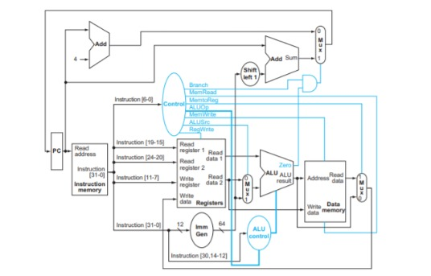

# 8-Bit Pipelined Microprocessor

> A fully custom 8-bit microprocessor designed in Verilog HDL, featuring both a single-cycle and a pipelined implementation, built as part of **IITISOC-2026**.


---

## Overview

This project implements a custom-designed 8-bit microprocessor from scratch in Verilog HDL. It includes:

- A **single-cycle CPU** where each instruction completes in one clock cycle
- A **pipelined CPU** with multi-stage execution for improved throughput
- A **custom Instruction Set Architecture (ISA)** with 24-bit fixed-width instructions
- A **custom assembler** to translate assembly mnemonics into binary machine code for the custom ISA

The design covers arithmetic, logic, memory, shift, branch, and jump operations, with a register file of 32 eight-bit registers and separate instruction and data memories.

---

## Repository Structure

```
8-bit-pipelined-microprocessor/
├── Modules/                  # Individual Verilog submodules
│   ├── alu.v                 # 8-bit ALU (11 operations)
│   ├── pc.v                  # 8-bit Program Counter
│   ├── Control_Unit.v        # Main control unit
│   ├── instruction_decoder.v # 24-bit instruction decoder
│   ├── Register_file.v       # 32 × 8-bit register file
│   ├── Data_Memory.v         # 32 × 8-bit data memory
│   ├── PC_Adder.v            # PC + 1 incrementer
│   ├── Branch_Adder.v        # Branch target calculator
│   ├── Mux.v                 # 2:1 MUX
│   └── MCPModule.v           # Top-level single-cycle CPU
├── Single_Cycle/
│   └── single_cycle.v        # Monolithic single-cycle implementation
├── Testbenches/              # Verilog testbenches
├── Simulation_Results/       # Waveform output and screenshots
├── Single_Cycle.jpeg         # Datapath block diagram
└── README.md
```

---

## Architecture

### Datapath Overview



The processor uses a **von Neumann-style datapath** with:

- **8-bit data bus**
- **8-bit address space** (256 addressable locations for PC)
- **24-bit fixed-width instruction format**
- **32 general-purpose registers** (R0–R31), each 8 bits wide
- **32-byte data memory**
- **Separate instruction memory** (up to 32 instructions)

### Control Signals

The `Control_Unit` generates the following signals per instruction:

| Signal | Width | Description |
|--------|-------|-------------|
| `RegWrite` | 1 | Enable write to register file |
| `ALUSrc` | 1 | Select immediate (1) or register (0) as ALU operand B |
| `MemWrite` | 1 | Enable data memory write |
| `MemRead` | 1 | Enable data memory read |
| `alu_control` | 4 | ALU operation selector |
| `ResultSrc` | 1 | Write-back source: memory (1) or ALU (0) |
| `PCSrc` | 1 | Next PC: branch/jump target (1) or PC+1 (0) |

---

## Custom ISA

### Instruction Format (24-bit)

```
 23      19 18     14 13      9  8      4  3      0
┌──────────┬──────────┬──────────┬──────────┬──────────┐
│  OPCODE  │    RS    │    RT    │    RD    │   FUNC   │  ← R-Type
│  5 bits  │  5 bits  │  5 bits  │  5 bits  │  4 bits  │
└──────────┴──────────┴──────────┴──────────┴──────────┘

 23      19 18     14 13      9  8              0
┌──────────┬──────────┬──────────┬──────────────┐
│  OPCODE  │    RS    │    RT    │   IMMEDIATE  │  ← I-Type / Branch
│  5 bits  │  5 bits  │  5 bits  │    8 bits    │
└──────────┴──────────┴──────────┴──────────────┘

 23      19 18                                  0
┌──────────┬─────────────────────────────────────┐
│  OPCODE  │            IMMEDIATE                │  ← J-Type (JUMP)
│  5 bits  │              8 bits (LSB)           │
└──────────┴─────────────────────────────────────┘
```

| Field | Bits | Description |
|-------|------|-------------|
| `OPCODE` | [23:19] | Instruction type |
| `RS` | [18:14] | Source register 1 |
| `RT` | [13:9] | Source register 2 |
| `RD` | [8:4] | Destination register |
| `FUNC` | [3:0] | ALU function code (R-type only) |
| `IMMEDIATE` | [7:0] | 8-bit immediate / offset |

---

### Instruction Set

#### R-Type Instructions (OPCODE = `01100`)

These use two source registers and write the result to a destination register. The `FUNC` field selects the operation.

| Mnemonic | FUNC | Operation | Description |
|----------|------|-----------|-------------|
| `ADD` | `0000` | `RD = RS + RT` | Integer addition with overflow detection |
| `SUB` | `0001` | `RD = RS - RT` | Integer subtraction with overflow detection |
| `MUL` | `0010` | `RD = RS × RT` | Integer multiplication |
| `DIV` | `0011` | `RD = RS / RT` | Integer division (result 0 if RT = 0) |
| `AND` | `0100` | `RD = RS & RT` | Bitwise AND |
| `OR` | `0101` | `RD = RS \| RT` | Bitwise OR |
| `NOT` | `0110` | `RD = ~RS` | Bitwise NOT (unary) |
| `XOR` | `0111` | `RD = RS ^ RT` | Bitwise XOR |

#### Shift Instructions

| Mnemonic | OPCODE | Operation | Description |
|----------|--------|-----------|-------------|
| `LSHIFT` | `00110` | `RD = RS << RT` | Logical left shift |
| `RSHIFT` | `00111` | `RD = RS >>> RT` | Arithmetic right shift (sign-extended) |

#### Memory Instructions

| Mnemonic | OPCODE | Operation | Description |
|----------|--------|-----------|-------------|
| `LOADI` | `00001` | `RT = RS + IMM` | Load immediate value into register |
| `LOAD` | `00010` | `RT = MEM[RS + IMM]` | Load byte from data memory |
| `STORE` | `00011` | `MEM[RS + IMM] = RT` | Store byte to data memory |

#### Branch & Jump Instructions

| Mnemonic | OPCODE | Condition | Description |
|----------|--------|-----------|-------------|
| `JUMP` | `00100` | Always | PC ← PC + IMM (unconditional jump) |
| `BEQ` | `01101` | Zero flag set | Branch if RS == RT |
| `BNE` | `01110` | Zero flag clear | Branch if RS ≠ RT |
| `BRANCH_OVF` | `01000` | Overflow flag set | Branch if last ADD/SUB overflowed |

#### Comparison Instructions

| Mnemonic | OPCODE | Operation | Description |
|----------|--------|-----------|-------------|
| `SLT` | `01001` | `RD = (RS < RT) ? 1 : 0` | Set less than (signed comparison) |

---

### ALU Operation Encoding

The 4-bit `alu_control` signal (generated by `Control_Unit`) maps to ALU operations:

| `alu_control` | Operation |
|---------------|-----------|
| `1000` | ADD |
| `1001` | SUBTRACT |
| `1010` | MULTIPLY |
| `1011` | DIVIDE |
| `1100` | AND |
| `1101` | OR |
| `1110` | NOT |
| `1111` | XOR |
| `0001` | Arithmetic Right Shift |
| `0010` | Left Shift |
| `0101` | Set Less Than (SLT) |

The ALU also outputs two status flags:
- **Zero**: asserted when result = 0 (used by BEQ / BNE)
- **Overflow**: asserted on signed ADD/SUB overflow (used by BRANCH_OVF)

---

## Module Descriptions

### `alu.v`
8-bit combinational ALU. Accepts two 8-bit operands and a 4-bit control signal. Outputs an 8-bit result along with `Zero` and `Overflow` flags. Supports 11 operations including arithmetic right shift and signed SLT.

### `instruction_decoder.v`
Decodes a 24-bit instruction word into its constituent fields: `opcode`, `func`, `rs`, `rt`, `rd`, and `immediate`. Handles all instruction formats (R-type, I-type, branches, and jump).

### `Control_Unit.v`
Combinational control unit. Takes the 5-bit `opcode`, 4-bit `func`, and the `Zero`/`Overflow` flags to generate all datapath control signals.

### `Register_file.v`
Synchronous write, asynchronous read register file with 32 registers of 8 bits each. Writes occur on the rising clock edge when `RegWrite` is asserted.

### `Data_Memory.v`
32 × 8-bit synchronous data memory. Supports separate read (`MemRead`) and write (`MemWrite`) enables. Resets to zero on the `reset` signal.

### `PC_Adder.v`
Simple incrementer: `PC_Plus1 = PC + 1`. Computes the sequential next program counter.

### `Branch_Adder.v`
Computes the branch/jump target: `BranchTarget = PC + Immediate`.

### `Mux.v`
Parameterized 2:1 multiplexer (8-bit). Used at three points in the datapath: ALU source select, write-back source select, and next-PC select.

### `MCPModule.v`
Top-level single-cycle CPU that instantiates and connects all submodules. Takes `clk` and `reset` as inputs and exposes the current ALU result on `result[7:0]`.

---

## Simulation

### Prerequisites

- [Icarus Verilog](http://iverilog.icarus.com/) (`iverilog` + `vvp`) or any compatible simulator (ModelSim, Vivado Simulator, etc.)
- [GTKWave](http://gtkwave.sourceforge.net/) for viewing waveforms (optional)

### Running the Single-Cycle Design

```bash
# Compile
iverilog -o sim_out Single_Cycle/single_cycle.v Testbenches/<testbench>.v

# Simulate
vvp sim_out

# View waveforms (if testbench generates a .vcd)
gtkwave dump.vcd
```

### Running with Separate Modules

```bash
iverilog -o sim_out \
  Modules/alu.v \
  Modules/pc.v \
  Modules/Control_Unit.v \
  Modules/instruction_decoder.v \
  Modules/Register_file.v \
  Modules/Data_Memory.v \
  Modules/PC_Adder.v \
  Modules/Branch_Adder.v \
  Modules/Mux.v \
  Modules/MCPModule.v \
  Testbenches/<testbench>.v

vvp sim_out
gtkwave dump.vcd
```

Simulation results (waveforms and output logs) are stored in the `Simulation_Results/` directory.

---

## Custom Assembler

A custom assembler is included to assemble programs written in the project's assembly language into 24-bit binary machine code compatible with the processor's instruction memory.

The assembler supports all ISA instructions with their mnemonic syntax and handles instruction encoding automatically, including opcode assignment, function code selection, register field packing, and immediate encoding.

---

## Example Program

The instruction memory in `single_cycle.v` is pre-loaded with a test program that exercises the full ISA:

```
ADD     R0 R1 R2         # ADD
SUB     R0 R1 R3         # SUBTRACT
MUL     R0 R1 R4         # MULTIPLY
DIV     R0 R1 R5         # DIVIDE
AND     R0 R1 R6         # AND
OR      R0 R1 R7         # OR
NOT     R0 R1 R8         # NOT
XOR     R0 R1 R9         # XOR
LOADI   R10, 3          # Load immediate (value to load = 3)
LOAD    R12, R13, 5          # Load from mem[R12 + 5]
STORE   R14, R15, #4          # Store to mem[R14 + 4]
JUMP    3                    # PC = PC + 3
LSH     R16, R17, R18         # Left shift (rs,rt,rd)
RSH     R19, R20, R21         # Arithmetic right shift (rs,rt,rd)
SLT     R22, R23, R24         # Set less than
BEQ     R25, R26, 2          # Branch if equal (offset 2)
BNE     R27, R28, 2          # Branch if not equal
BOV     R29, R30, 4          #Branch Overflow
```

---

## Contributors

This project was built as part of **IITISOC-2026** (IIT Indore Summer of Code).The team consists of the following members:
1)Anshuman Nema-250002015
2)Nilesh Kalra-250002044
3)Tanuj Malay Jog-250002075
4)Abhinav Shailesh Chavan-250002006

---

## License

This project is open-source and available for educational and research use. See individual files for any specific licensing notes.
